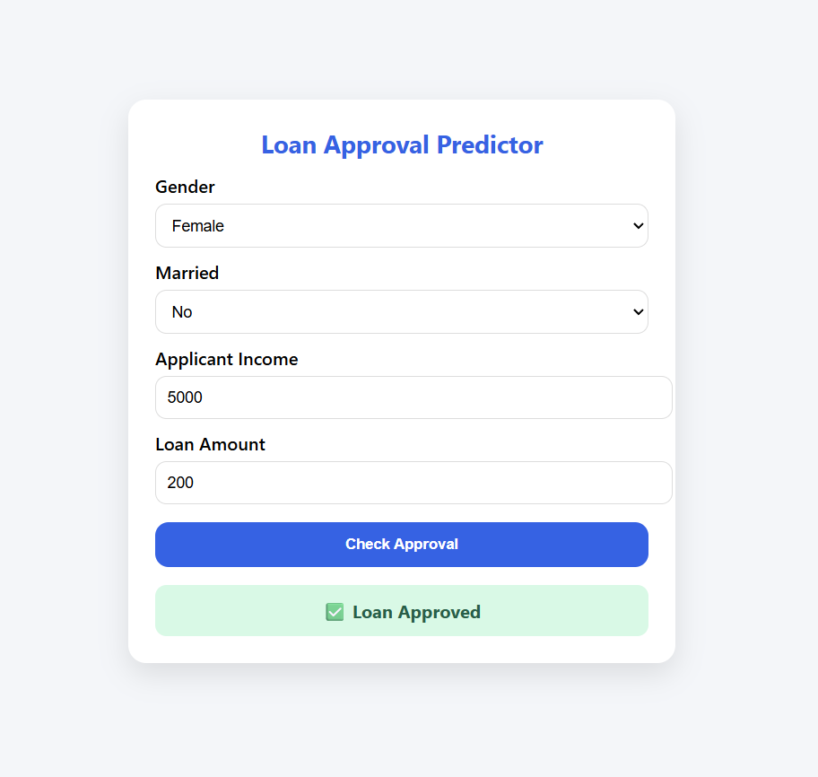

# Loan Approval Prediction System

## Description
Developed a machine learning web application to predict loan approval based on applicant financial and personal data. Implemented data preprocessing and trained a Logistic Regression model for accurate classification. The application provides quick insights into loan eligibility, helping users make informed financial decisions.

## Features
- Predicts loan approval status (Approved / Rejected) based on user input
- Handles applicant financial and personal data
- Implements Logistic Regression for binary classification
- Responsive web interface for real-time predictions

## Tech Stack
Python, FastAPI, scikit-learn, pandas, Joblib, HTML, CSS, JavaScript

